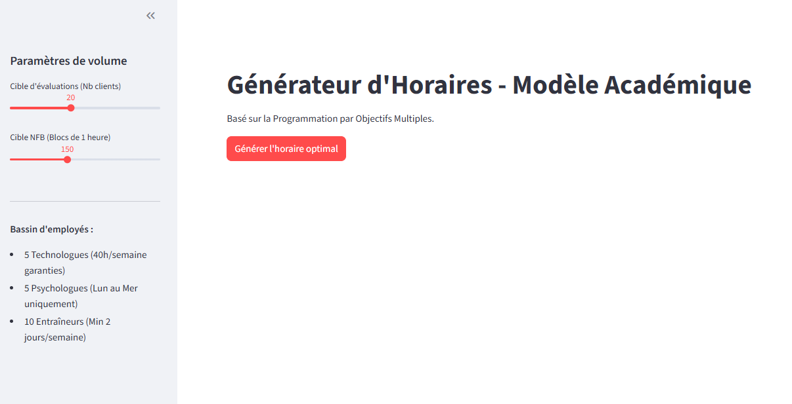
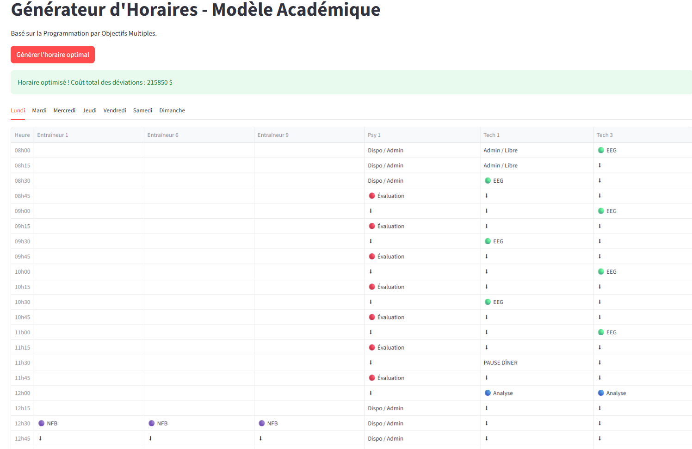

# Clinical Schedule Optimization (Goal Programming)

An interactive web application built with Python and Streamlit that automatically generates optimized clinical shift schedules using Operations Research (Goal Programming).

## 📸 Application Screenshots


*Figure 1: Interactive parameters and target settings in the sidebar.*


*Figure 2: The optimal schedule generated by the CPLEX engine, grouped by day and employee.*

---

## 🎯 The Challenge
In a multidisciplinary clinical setting, manual shift scheduling is a complex puzzle that requires balancing multiple conflicting constraints:
*   **Physical Limitations:** Limited availability of consultation rooms.
*   **Labor Contracts:** Guaranteed weekly hours, minimum shifts, and mandatory lunch/dinner breaks.
*   **Logical Sequencing:** Specific clinical tasks must happen in a predefined order (e.g., an evaluation must precede a treatment).
*   **Business Targets:** Hitting specific weekly production goals for various treatments and exams.

## 💡 The Solution
This project models the scheduling problem using **Multi-Objective Goal Programming**. Instead of simply finding a "feasible" solution, the mathematical model minimizes deviations from ideal business targets (e.g., maximizing treatment outputs while minimizing the cost of adding extra shifts).

**Key Features:**
*   **Mathematical Engine:** Built with IBM CPLEX (DOcplex), utilizing binary decision variables, continuous variables, and complex transition constraints.
*   **Interactive UI:** A Streamlit dashboard allowing users to tweak volume targets and immediately visualize the impact on the schedule.
*   **Data Processing:** Pandas is used to pivot and transform the solver's output into a clean, readable weekly grid.

## 🛠️ Built With
*   **[Python 3](https://www.python.org/)**
*   **[Streamlit](https://streamlit.io/)** - Frontend framework
*   **[DOcplex (IBM CPLEX)](https://pypi.org/project/docplex/)** - Optimization solver
*   **[Pandas](https://pandas.pydata.org/)** - Data manipulation

## 🚀 How to Run Locally

1. Clone this repository:
```bash
git clone [https://github.com/fred1couillard/clinical-schedule-optimization.git](https://github.com/fred1couillard/clinical-schedule-optimization.git)
```

2. Navigate to the project directory:
```bash
cd clinical-schedule-optimization
```

3. Install the required dependencies:
```bash
pip install -r requirements.txt
```

4. Launch the application:
```bash
streamlit run app.py
```
